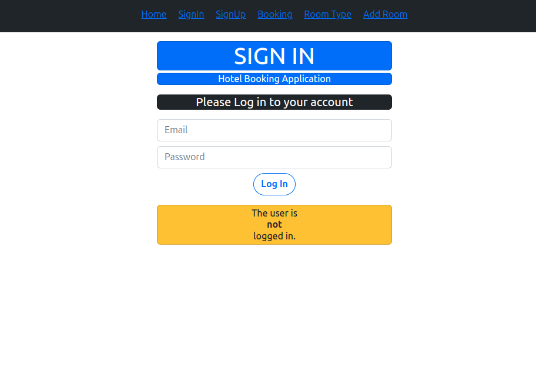
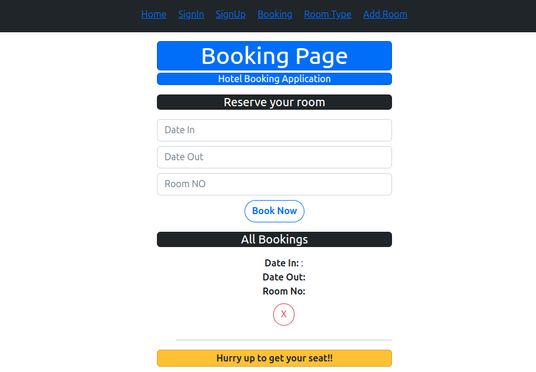
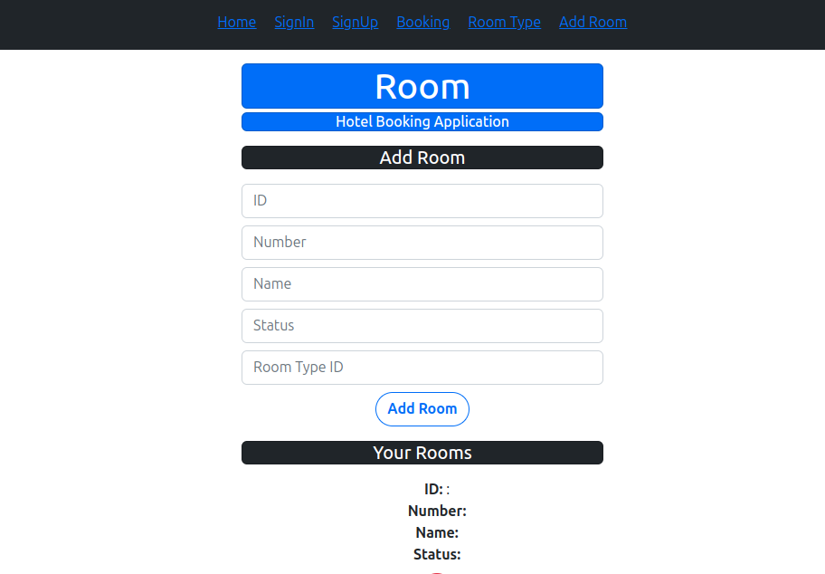
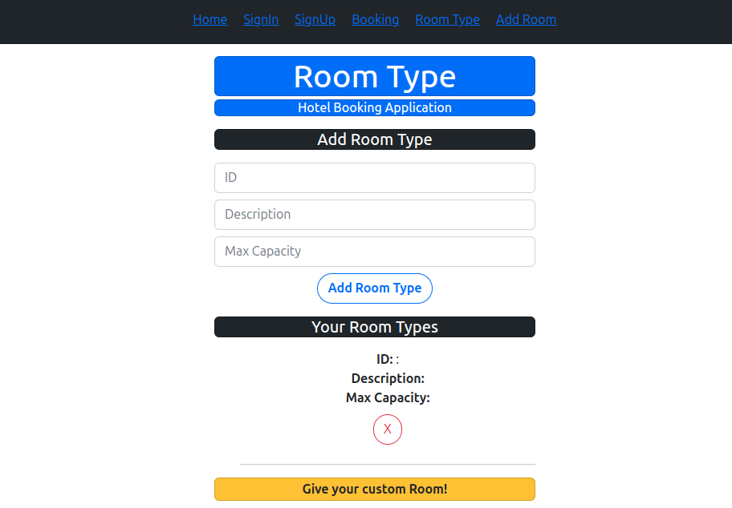

# Hotel Booking Frontend  

This is the **frontend** of a hotel booking application developed as part of a database project. The **backend** is built with **FastAPI**, **SQLAlchemy**, and **PostgreSQL**, and can be found here: [Hotel Booking App Backend](https://github.com/nihalbaig0/Hotel-booking-App-Backend).  

---

## Project Overview  

The Hotel Booking Application provides the following features:  
- **User Authentication**: Secure login to access the booking system.  
- **Room Reservation**: Browse available rooms and make reservations.  
- **Room Management**: Add new room types or update existing ones.  
- **Real-Time Integration**: Fully integrated with a backend API for database operations.  

---








## Frontend Setup  

### Prerequisites  

- Node.js (v14 or higher)  
- npm (v6 or higher)  

### Installation  

1. Clone the frontend repository:  

   ```
   git clone https://github.com/nihalbaig0/Hotel-Booking-Frontend.git  

   cd Hotel-Booking-Frontend 

   npm install  

   npm start 

```


